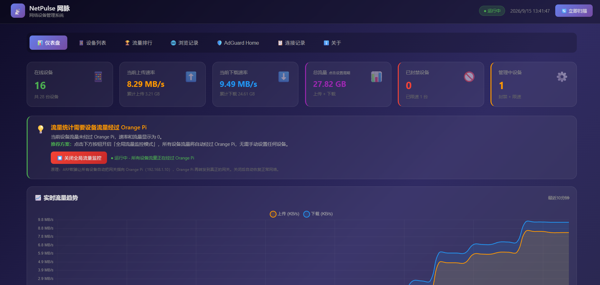
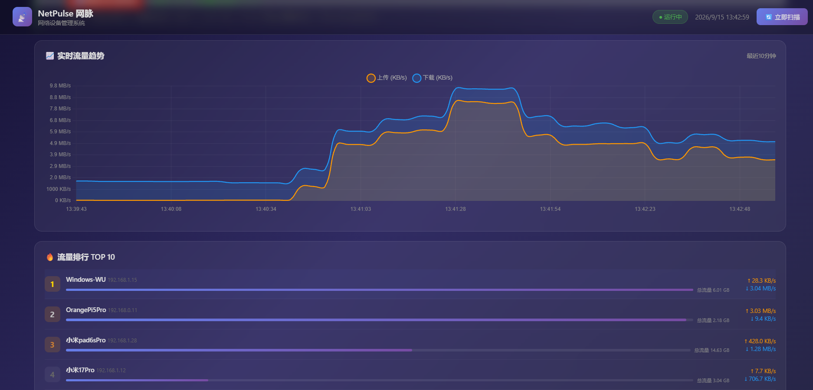
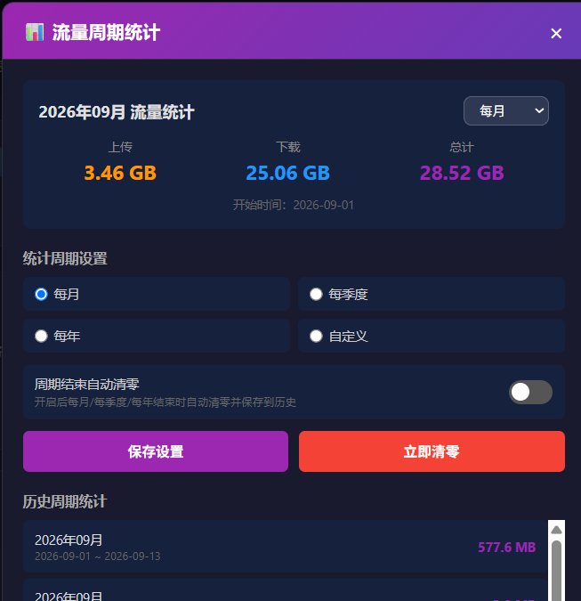
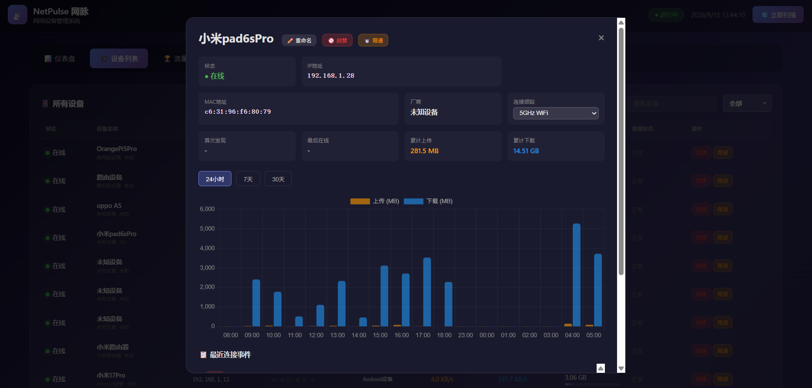
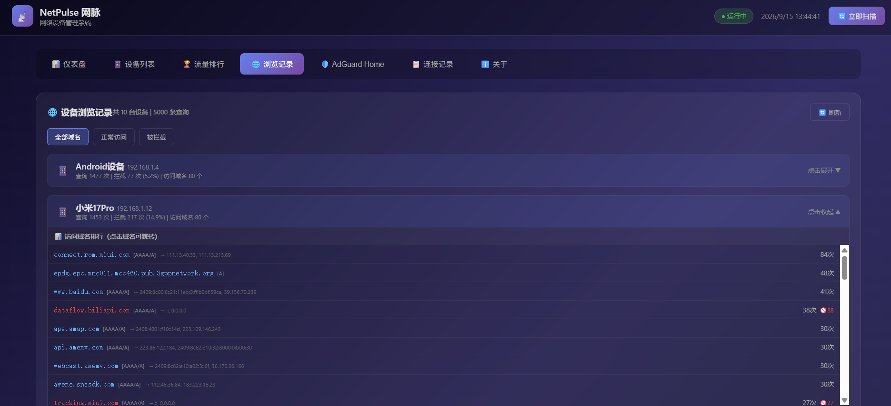
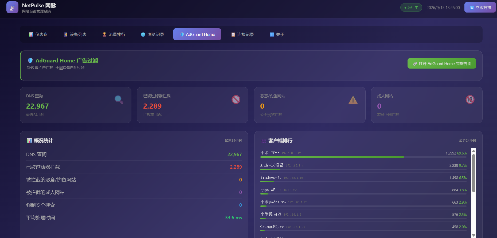

# NetPulse 网脉

轻量级网络设备管理系统，专为家庭/小型办公室网络设计。基于 Python + Flask + SQLite + iptables，运行在 Orange Pi / 树莓派等 Linux 设备上。支持实时流量监控、设备封禁/限速、AdGuard Home 广告过滤集成、浏览记录审计、周期流量统计等功能。


---

## 📸 界面预览

| 仪表盘 | 设备列表 |
|--------|----------|
|  |  |

| 设备详情 | 流量排行 |
|----------|----------|
|  |  |

| 浏览记录 | AdGuard Home |
|----------|--------------|
|  |  |

---

## ✨ 功能特性

### 📊 仪表盘
- 实时显示在线设备数量、上传/下载速率、总流量
- 实时流量趋势图（最近10分钟，每秒更新）
- 流量排行 TOP10（带进度条和速率显示）
- 全局流量监控模式开关（一键开启/关闭）
- 周期流量统计卡片（每月/每季度/每年/自定义）

### 📱 设备管理
- 自动扫描局域网所有设备（ARP + Ping，支持跨网段）
- 显示设备IP、MAC、厂商信息
- 设备在线/离线状态实时监测
- 设备重命名
- WiFi频段标注（2.4G/5G/有线，点击切换）
- 设备详情弹窗（24小时/7天/30天流量趋势图）

### 🚫 设备控制
- **封禁设备**：一键踢出网络（ARP欺骗 + iptables DROP）
- **设备限速**：基于 tc HTB 的上下行限速（可设独立上下行带宽）
- **网络优先级（QoS）**：高/中/低三级，拥塞时优先保障高优先级设备（不是限速）
- **全局流量监控**：一键开启，所有设备流量自动经过管理设备
- **自动修复机制**：ARP实时抢答+心跳检测，掉线自动恢复，统计链/NAT 规则自动修复

### 📈 流量统计
- iptables 内核级精确流量计数（独立统计链，与设备规则互不影响）
- IPv4 + IPv6 合并统计
- 实时上传/下载速率（滑动窗口平均）
- 每设备累计流量统计
- 24小时/7天/30天流量趋势图（柱状图）
- 全局流量监控默认开启，开机自动启动
- 统计链丢失后约10秒内自动重建，重启/掉线后可自愈

### 🏆 流量排行
- 按今天/本周/本月统计
- 按总流量/下载/上传排序
- 前三名奖牌样式展示（金/银/铜）
- 点击设备查看详情
- 显示在线/离线状态

### 🌐 浏览记录
- 基于 AdGuard Home DNS 查询日志
- 显示所有设备访问的域名（不只是被拦截的）
- 按设备分组展示，可展开查看详情
- 域名可点击直接跳转访问
- 显示DNS记录类型（A/AAAA/CNAME/HTTPS等）
- 显示解析IP地址和查询耗时
- 支持按全部/正常访问/被拦截筛选
- 最近访问记录时间线

### 🛡️ AdGuard Home 集成
- 一键跳转 AdGuard Home 完整管理界面
- 实时显示 DNS 查询数、拦截数、拦截率
- 恶意/钓鱼网站拦截统计
- 成人网站拦截统计（家长控制）
- 客户端排行（带进度条，自动匹配设备名称）
- 请求域名排行（可点击跳转）
- 被拦截域名排行
- 平均处理时间显示
- DNS 劫持自动过滤（所有设备无需手动设置DNS）

### 📊 周期流量统计
- 支持每月/每季度/每年/自定义天数周期
- 切换周期不清理数据（手动清零）
- 自动清零开关（周期结束自动清零并保存历史）
- 历史周期保留20个，自动覆盖最旧记录
- 最新历史在最前面
- 上传/下载/总计分别统计

### 📋 连接记录
- 设备首次发现记录
- 设备上下线记录
- 封禁/限速操作记录
- 最多保留90天历史
- 按时间倒序排列

---

## 🖥️ 系统要求

### 硬件
- **推荐**：Orange Pi Zero 2（1GB内存）/ 树莓派4B（2GB+）
- **最低**：任何能运行 Linux 的设备（512MB内存以上）
- 网络：有线或WiFi连接到路由器（建议有线，更稳定）
- 存储：8GB以上 SD 卡或 eMMC

### 软件
- 操作系统：Ubuntu 20.04+ / Debian 11+ / Armbian
- Python：3.7+
- 权限：root（iptables和tc需要）
- 依赖：iptables、iproute2（tc）、arping、curl

---

## 🚀 快速开始（一键部署）

### 方式一：一键安装脚本（推荐）

```bash
# 下载并运行一键安装脚本
curl -sSL https://raw.githubusercontent.com/WU-AetherCore/NetPulse/main/install.sh | sudo bash
```

安装过程中会提示设置 Web 管理员密码（也可用环境变量 `NETPULSE_ADMIN_PASSWORD` 非交互传入）。

安装完成后访问：`http://<设备IP>:8081`

### 方式二：手动部署

详见下方 [📦 手动部署步骤](#-手动部署步骤)

---

## 📦 手动部署步骤

### 第一步：安装系统依赖

```bash
sudo apt update
sudo apt install -y python3 python3-pip python3-venv iptables iproute2 arping curl
```

### 第二步：下载项目

```bash
# 克隆仓库
git clone https://github.com/WU-AetherCore/NetPulse.git
cd NetPulse

# 或者下载 ZIP 包
wget https://github.com/WU-AetherCore/NetPulse/archive/refs/heads/main.zip
unzip main.zip
cd NetPulse-main
```

### 第三步：创建虚拟环境并安装依赖

```bash
# 创建虚拟环境
python3 -m venv venv
source venv/bin/activate

# 安装 Python 依赖
pip install -r requirements.txt
```

### 第四步：配置系统

编辑 `config.py`，根据你的网络修改配置：

```python
# 网络配置
NETWORK_CIDR = "192.168.1.0/24"     # 你的网段
NETWORK_GATEWAY = "192.168.1.1"     # 路由器网关IP
MONITOR_INTERFACE = "eth0"          # 监控网口（eth0或wlan0）

# 设备管理配置
GATEWAY_IP = "192.168.1.1"          # 网关IP
LOCAL_MAC = "aa:bb:cc:dd:ee:ff"     # 本机MAC地址（用 ifconfig 查看）
MANAGE_INTERFACE = "eth0"            # 管理网口

# Web服务
WEB_PORT = 8081                      # Web界面端口
```

查看本机MAC地址：
```bash
ifconfig | grep ether
# 或
ip link show eth0
```

> 🔐 **安全提示（重要）**：管理员密码不要写死在 `config.py` 里。仓库自带的 `config.py` 是脱敏模板，密码通过环境变量 `NETPULSE_ADMIN_PASSWORD` 读取（默认 `admin123`，仅限首次登录，请务必修改）。可复制 `env.example` 为 `.env` 填写真实密码，并在 systemd 服务中用 `EnvironmentFile=/opt/netpulse/.env` 加载。`.env` 已在 `.gitignore` 中，不会被提交。

### 第五步：配置 systemd 服务（开机自启）

```bash
# 复制服务文件
sudo cp netpulse.service /etc/systemd/system/

# 编辑服务文件，修改路径为你的实际路径
sudo nano /etc/systemd/system/netpulse.service

# 重新加载并启动
sudo systemctl daemon-reload
sudo systemctl enable netpulse
sudo systemctl start netpulse

# 查看状态
sudo systemctl status netpulse
```

### 第六步：配置自动监控恢复（可选但推荐）

```bash
# 复制监控脚本
sudo cp netpulse-monitor.sh /usr/local/bin/
sudo chmod +x /usr/local/bin/netpulse-monitor.sh

# 添加到 crontab（每分钟检查一次）
sudo crontab -e
# 添加以下行：
* * * * * /usr/local/bin/netpulse-monitor.sh >> /var/log/netpulse-monitor.log 2>&1
```

### 第七步：访问Web界面

在浏览器中打开：`http://<设备IP>:8081`

---

## 🛡️ AdGuard Home 安装与集成教程

NetPulse 深度集成了 AdGuard Home，实现全屋 DNS 级广告过滤。以下是完整的安装和配置步骤。

### 什么是 AdGuard Home？

AdGuard Home 是一个网络级广告和跟踪拦截软件。它作为 DNS 服务器运行，可以拦截整个网络中所有设备的广告、跟踪器和恶意网站，无需在每个设备上安装任何软件。

**特点：**
- DNS 级广告拦截（电视、手机、平板、智能家居全部过滤）
- 空载内存仅占用 40~80MB，Orange Pi Zero 2 1GB 完全无压力
- 功耗极低（3W 左右）
- Web 管理界面，可视化统计
- 支持自定义过滤规则
- 支持家长控制（成人网站拦截）
- 支持安全浏览（恶意/钓鱼网站拦截）

### 第一步：安装 AdGuard Home

```bash
# 下载 AdGuard Home（ARM64 版本，适用于 Orange Pi Zero 2）
cd /tmp
wget https://github.com/AdguardTeam/AdGuardHome/releases/latest/download/AdGuardHome_linux_arm64.tar.gz

# 解压
tar -xzf AdGuardHome_linux_arm64.tar.gz

# 安装到 /opt 目录
sudo mv AdGuardHome /opt/
cd /opt/AdGuardHome

# 安装为系统服务
sudo ./AdGuardHome -s install
```

> **注意：** 如果是其他架构（如树莓派的 armv7），请下载对应的版本：
> - ARM64（Orange Pi Zero 2、树莓派4 64位系统）：`AdGuardHome_linux_arm64.tar.gz`
> - ARMv7（树莓派3/4 32位系统）：`AdGuardHome_linux_armv7.tar.gz`
> - AMD64（x86 电脑）：`AdGuardHome_linux_amd64.tar.gz`

### 第二步：初始化配置

1. 在浏览器中打开：`http://<设备IP>:3000`
2. 按照安装向导进行配置：
   - **监听接口**：选择 `eth0`（或你的网口）
   - **DNS 端口**：保持默认 `53`
   - **Web 端口**：保持默认 `3000`
   - 设置管理员用户名和密码
3. 完成安装后，登录 AdGuard Home 管理界面

### 第三步：配置上游 DNS

在 AdGuard Home 管理界面中：
1. 进入「设置」→「DNS 设置」
2. 上游 DNS 服务器推荐配置：
```
https://dns.alidns.com/dns-query
https://doh.pub/dns-query
1.1.1.1
8.8.8.8
223.5.5.5
119.29.29.29
```
3. 点击「测试上游 DNS」确认可用
4. 点击「保存」

### 第四步：启用过滤规则

在 AdGuard Home 管理界面中：
1. 进入「过滤器」→「DNS 封锁清单」
2. 推荐启用以下规则：
   - ✅ AdGuard DNS 过滤器（默认）
   - ✅ AdGuard 跟踪保护过滤器
   - ✅ AdGuard 社交媒体过滤器
   - ✅ 恶意软件域名拦截
   - ✅ 网络钓鱼域名拦截
   - ✅ 成人网站拦截（家长控制，可选）
3. 点击「检查更新」更新规则

> **注意：** 1GB 内存设备不要加载过多超大黑名单，精简规则集即可。更新 gravity（域名库）时会临时吃内存，建议开启 swap。

### 第五步：配置 DNS 劫持（全屋自动过滤）

这是最关键的一步。配置后，所有连接到路由器的设备**无需任何设置**，自动使用 AdGuard Home 进行 DNS 解析，实现全屋广告过滤。

```bash
# 创建 DNS 劫持脚本
sudo tee /usr/local/bin/netpulse-nat.sh > /dev/null << 'EOF'
#!/bin/bash
# NetPulse NAT/IP转发/DNS劫持脚本

# 开启IP转发
echo 1 > /proc/sys/net/ipv4/ip_forward

# 配置 NAT（让管理设备能转发流量）
iptables -t nat -F POSTROUTING
iptables -t nat -A POSTROUTING -o eth0 -j MASQUERADE

# DNS 劫持：将所有 UDP 53 端口的请求重定向到本地 AdGuard Home
iptables -t nat -F PREROUTING
iptables -t nat -A PREROUTING -i eth0 -p udp --dport 53 -j REDIRECT --to-port 53
iptables -t nat -A PREROUTING -i eth0 -p tcp --dport 53 -j REDIRECT --to-port 53

echo "NAT and DNS hijack configured successfully"
EOF

# 添加执行权限
sudo chmod +x /usr/local/bin/netpulse-nat.sh

# 创建 systemd 服务
sudo tee /etc/systemd/system/netpulse-nat.service > /dev/null << 'EOF'
[Unit]
Description=NetPulse NAT and DNS Hijack
After=network.target

[Service]
Type=oneshot
ExecStart=/usr/local/bin/netpulse-nat.sh
RemainAfterExit=yes

[Install]
WantedBy=multi-user.target
EOF

# 启用并启动
sudo systemctl daemon-reload
sudo systemctl enable netpulse-nat
sudo systemctl start netpulse-nat
```

### 第六步：验证广告过滤

1. 确保 NetPulse 的「全局流量监控模式」已开启（仪表盘点击开启）
2. 在任意设备上访问广告测试网站：`https://adguard.com/test.html`
3. 应该能看到大部分广告被拦截
4. 在 NetPulse 的「🛡️ AdGuard Home」页面可以看到实时拦截统计

### 第七步：在 NetPulse 中查看 AdGuard Home 数据

NetPulse 已经内置了 AdGuard Home 数据集成，无需额外配置：

1. 打开 NetPulse Web 界面（`http://<设备IP>:8081`）
2. 点击顶部导航栏的「🛡️ AdGuard Home」标签
3. 可以看到：
   - 4个统计卡片（DNS查询、已拦截、恶意网站、成人网站）
   - 概况统计表格
   - 客户端排行（自动匹配 NetPulse 中的设备名称）
   - 请求域名排行（可点击跳转）
   - 被拦截域名排行
4. 点击「🔗 打开 AdGuard Home 完整界面」按钮可跳转到 AdGuard Home 原生管理界面

### AdGuard Home 常用管理命令

```bash
# 查看状态
sudo systemctl status adguardhome

# 启动/停止/重启
sudo systemctl start adguardhome
sudo systemctl stop adguardhome
sudo systemctl restart adguardhome

# 查看日志
sudo journalctl -u adguardhome -f

# 卸载
sudo /opt/AdGuardHome/AdGuardHome -s uninstall
```

### AdGuard Home 配置文件位置

- 主程序：`/opt/AdGuardHome/AdGuardHome`
- 配置文件：`/opt/AdGuardHome/AdGuardHome.yaml`
- 数据目录：`/opt/AdGuardHome/data/`
- 日志：`/opt/AdGuardHome/data/querylog.json`

---

## ⚙️ 配置说明

### config.py 详细配置

| 配置项 | 默认值 | 说明 |
|--------|--------|------|
| `WEB_HOST` | `0.0.0.0` | Web服务监听地址 |
| `WEB_PORT` | `8081` | Web服务端口 |
| `NETWORK_CIDR` | `192.168.1.0/24` | 扫描的网段（支持多网段，逗号分隔） |
| `NETWORK_GATEWAY` | `192.168.1.1` | 网关IP |
| `GATEWAY_IP` | `192.168.1.1` | 网关IP（用于ARP欺骗） |
| `LOCAL_MAC` | - | 本机MAC地址（必须配置） |
| `MANAGE_INTERFACE` | `eth0` | 管理网口 |
| `SCAN_INTERVAL` | `60` | 设备扫描间隔（秒；较大间隔可降低 ARP 广播风暴、提升无线稳定性） |
| `TRAFFIC_INTERVAL` | `3` | 流量统计间隔（秒） |
| `TRAFFIC_CHAIN` | `NETPULSE` | iptables链名 |
| `HOURLY_RETENTION_DAYS` | `7` | 小时流量保留天数 |
| `DAILY_RETENTION_DAYS` | `90` | 天流量保留天数 |
| `OFFLINE_THRESHOLD` | `120` | 设备离线判定阈值（秒） |
| `ADGUARD_URL` | `http://127.0.0.1:3000` | AdGuard Home API 地址 |
| `GLOBAL_SPOOF_DEFAULT` | `True` | 全局流量监控默认开启 |
| `ADMIN_PASSWORD` | 环境变量 `NETPULSE_ADMIN_PASSWORD` | Web 管理密码，请勿硬编码在 config.py（见 env.example） |

---

## 📖 使用说明

### 开启流量统计

NetPulse 需要设备流量经过管理设备才能统计流量。有两种方式：

#### 方式一：全局流量监控模式（推荐，默认开启）

1. 打开仪表盘
2. 找到「流量统计需要设备流量经过 Orange Pi」卡片
3. 点击「🚀 开启全局流量监控模式」
4. 所有设备流量将自动经过管理设备，无需手动设置

**原理**：通过ARP欺骗让所有设备以为网关是管理设备，流量自动转发。

**自动恢复机制（v2.5 增强）**：
- ARP 采用「实时抢答 + 1 秒高频定时推送」双线程：设备一发起 `who-has` 网关查询立即抢答（burst 连发抢占），并监听真网关/中继发出的网关 ARP Reply 进行反向压制，显著提升无线中继场景下的劫持稳定性
- 推送线程与抢答线程均带心跳，任一线程心跳超过 30 秒无更新即被判定死亡并整体自动重启
- 独立流量统计链 `NETSTATS`/`NETSTATS6` 与设备封禁/限速规则完全分离：每 3 秒采样校验，统计链丢失约 10 秒内自动重建，计数器回退自动重置基线——重启、掉线后速率不再恒为 0 或呈直线
- NAT、IP 转发（IPv4/IPv6）规则丢失自动重新配置；IPv4+IPv6 流量合并统计
- 扫描限速（分批 + 60 秒间隔），把 ARP 广播包速率降低约 90%，避免广播风暴挤占 WiFi 空口
- 如果服务进程本身崩溃，crontab 监控脚本会自动重启

**注意**：
- 开启期间管理设备必须保持运行，否则设备会断网
- 关闭后自动恢复正常网络
- 部分有ARP防护的企业级设备可能不受影响
- 全局流量监控默认开启，开机自动启动

#### 方式二：手动设置网关

在每台设备上手动设置网关为管理设备的IP（如192.168.1.10）。

### 封禁设备

1. 进入「设备列表」
2. 找到要封禁的设备，点击「封禁」按钮
3. 确认后设备将无法访问互联网
4. 点击「解封」恢复网络

**原理**：ARP欺骗 + iptables DROP，被封禁设备的所有流量都会被丢弃。

### 设备限速

1. 进入「设备列表」
2. 点击「限速」按钮
3. 输入上传和下载限速值（kbps，1Mbps=1024kbps）
4. 提供快捷按钮：512k / 1M / 2M / 5M / 10M / 20M
5. 点击「取消」解除限速

**原理**：基于 tc HTB（Hierarchical Token Bucket）的流量控制，可独立设置上下行带宽。

### 设置网络优先级（QoS）

1. 进入「设备列表」，点击「优先级」按钮
2. 选择 高 / 中（默认）/ 低
3. 高优先级设备在网络拥塞时优先获得带宽保障，低优先级设备让路

**原理**：tc HTB 三级优先级类（prio 1/2/3），这是「拥塞时的调度优先级」，**不是限速**；不拥塞时所有设备速度一致。

### 标注WiFi频段

1. 进入「设备列表」
2. 点击设备名称下方的频段标签（默认"未知"）
3. 标签会循环切换：未知 → 2.4G → 5G → 有线 → 未知
4. 或在设备详情弹窗中使用下拉菜单选择

### 查看流量排行

1. 点击「流量排行」标签
2. 选择时间范围：今天/本周/本月
3. 选择排序方式：总流量/下载/上传
4. 点击设备查看详情

### 查看浏览记录

1. 点击「🌐 浏览记录」标签
2. 按设备分组展示，点击设备卡片展开详情
3. 可以看到：
   - 该设备访问的所有域名排行（点击可跳转）
   - DNS记录类型（A/AAAA/CNAME/HTTPS等）
   - 解析IP地址
   - 最近访问记录时间线
4. 支持筛选：全部域名 / 正常访问 / 被拦截

> **注意**：浏览记录基于 DNS 查询日志，只能看到域名，看不到具体页面内容。99% 的现代网站使用 HTTPS 加密，具体页面内容和输入文字无法通过 DNS 层面获取。

### 周期流量统计

1. 点击仪表盘的「总流量」卡片
2. 弹出周期统计弹窗，可以看到：
   - 当前周期的上传/下载/总计流量
   - 周期开始时间
3. 选择统计周期：每月 / 每季度 / 每年 / 自定义天数
4. 自动清零开关：开启后周期结束自动清零并保存到历史
5. 手动清零：点击「立即清零」按钮，当前周期数据保存到历史
6. 历史周期保留20个，最新的在最前面，超过20个自动覆盖最旧记录

> **重要**：切换周期不会清理数据，只有手动点击「立即清零」或开启自动清零后周期结束才会清零。

### AdGuard Home 集成

1. 点击「🛡️ AdGuard Home」标签
2. 查看实时统计数据（每5秒自动刷新）
3. 点击「🔗 打开 AdGuard Home 完整界面」跳转到原生管理界面
4. 客户端排行会自动匹配 NetPulse 中的设备名称

---

## 🔌 API 文档

### 系统概览
```
GET /api/summary
```

### 设备列表
```
GET /api/devices
```

### 设备详情
```
GET /api/device/<mac>
```

### 设备重命名
```
POST /api/device/<mac>/rename
Content-Type: application/json
{"name": "新名称"}
```

### 封禁设备
```
POST /api/device/<mac>/block
```

### 解除封禁
```
POST /api/device/<mac>/unblock
```

### 设备限速
```
POST /api/device/<mac>/limit
Content-Type: application/json
{"upload_kbps": 100, "download_kbps": 500}
```

### 取消限速
```
POST /api/device/<mac>/unlimit
```

### 设置WiFi频段
```
POST /api/device/<mac>/band
Content-Type: application/json
{"band": "5g"}  // 2.4g / 5g / wired / unknown
```

### 流量排行
```
GET /api/traffic-ranking?days=7&sort=total
// days: 1 / 7 / 30
// sort: total / download / upload
```

### 全局流量监控状态
```
GET /api/global-spoof/status
```

### 开启全局流量监控
```
POST /api/global-spoof/enable
```

### 关闭全局流量监控
```
POST /api/global-spoof/disable
```

### 连接事件
```
GET /api/events?limit=100&mac=<可选>
```

### 立即扫描
```
POST /api/scan
```

### 浏览记录
```
GET /api/browsing-history?limit=3000
```

### AdGuard Home 统计
```
GET /api/adguard-stats
```

### 周期流量统计
```
GET /api/period-summary
```

### 设置周期
```
POST /api/period-settings
Content-Type: application/json
{"period_type": "monthly", "custom_days": 30, "auto_reset": true}
// period_type: monthly / quarterly / yearly / custom
```

### 清零周期
```
POST /api/period-reset
```

---

## 🛠️ 常见问题

### Q: 流量统计显示0 / 速率一直是直线怎么办？
A: v2.5 已把流量统计链 `NETSTATS`/`NETSTATS6` 独立出来并带自动重建（丢失约10秒自愈）。若仍异常，按顺序排查：
```bash
# 1. 统计链是否存在、计数器是否在涨
sudo iptables -L NETSTATS -n -v -x
sudo ip6tables -L NETSTATS6 -n -v -x

# 2. 全局监控是否开启、两个欺骗线程是否存活（thread_alive / sniffer_alive 应为 true）
curl -s http://localhost:8081/api/global-spoof/status

# 3. IP 转发与 NAT
cat /proc/sys/net/ipv4/ip_forward   # 应为 1
sudo iptables -t nat -L POSTROUTING -n

# 4. 看实时日志（是否在反复重建/抢答）
sudo journalctl -u netpulse -f
```
统计链异常时程序会自动重建，无需手动干预；计数器回退（如重启、手动删链）会自动重置基线，不会再出现负速率或卡死。

### Q: 为什么手机看视频实际有几 MB/s，界面却明显偏小？
A: 这通常不是统计程序问题，而是**无线中继拓扑下个别设备的网关 ARP 缓存漂移**——设备省电休眠醒来后，可能短暂把网关指回真路由，这段流量不经过板子就统计不到。v2.5 用「ARP 实时抢答 + burst 连发 + 反向压制真路由宣告 + 1 秒定时兜底」大幅降低了这种漂移。可用以下命令确认某设备（如手机 192.168.1.5）二层帧是否稳定经过本机 MAC：
```bash
sudo tcpdump -i eth0 -nn -e 'host 192.168.1.5'
```
若数据帧在本机 MAC 与真网关 MAC 之间反复横跳，说明空口侧仍在竞争，可把该设备 WiFi 设置为「始终保持连接/关闭省电」，或改用有线连接管理设备。

### Q: 开启全局监控后设备断网了？
A: 检查管理设备的IP转发是否开启：
```bash
cat /proc/sys/net/ipv4/ip_forward  # 应该返回1
sudo sysctl -w net.ipv4.ip_forward=1
```
检查NAT规则：
```bash
sudo iptables -t nat -L POSTROUTING -n
```
NetPulse 有自动修复机制，每30秒会自动检查并修复，如果持续断网请检查日志：
```bash
sudo journalctl -u netpulse -f
```

### Q: 设备封禁不生效？
A: 确保设备和管理设备在同一网段，并且管理设备有root权限。检查：
```bash
sudo iptables -L NETPULSE_BLOCK -n
```
注意：与流量统计同理，封禁/限速依赖设备流量经过管理设备；无线中继下个别省电设备可能短暂漂移，实时抢答机制会持续把它拉回。

### Q: 如何修改Web端口？
A: 编辑 `config.py` 中的 `WEB_PORT`，然后重启服务：
```bash
sudo systemctl restart netpulse
```

### Q: 忘记管理员密码？
A: 通过环境变量重置。编辑服务的环境文件（如 `/opt/netpulse/.env`）写入 `NETPULSE_ADMIN_PASSWORD=新密码`，然后 `sudo systemctl restart netpulse`。

### Q: 数据存在哪里？
A: SQLite数据库文件 `netpulse.db`，在程序运行目录下（`/opt/netpulse/netpulse.db`）。

### Q: 如何备份数据？
A: 复制 `netpulse.db` 文件即可，恢复时放回原目录。建议定期备份：
```bash
cp netpulse.db netpulse.db.backup.$(date +%Y%m%d)
```

### Q: 支持哪些路由器？
A: 任何标准路由器都支持，不需要路由器特殊功能。中继模式下也能正常工作（v2.5 针对无线中继做了 ARP 实时抢答加固）。支持跨网段设备扫描。

### Q: AdGuard Home 广告过滤不生效？
A: 检查以下几点：
1. 确保 NetPulse 全局流量监控已开启
2. 确保 DNS 劫持规则已配置：
```bash
sudo iptables -t nat -L PREROUTING -n
```
3. 确保 AdGuard Home 服务正在运行：
```bash
sudo systemctl status adguardhome
```
4. 在设备上测试 DNS 解析：
```bash
nslookup doubleclick.net
# 应该返回 0.0.0.0 或被拦截
```

### Q: 浏览记录看不到某些设备？
A: 浏览记录基于 AdGuard Home 的 DNS 查询日志。如果某些设备没有显示：
1. 确保该设备流量经过 NetPulse（全局流量监控已开启）
2. 确保 DNS 劫持规则生效
3. 该设备可能使用了 DoH/DoT（加密DNS），绕过了普通 DNS 劫持

### Q: 1GB 内存够吗？
A: 完全够用。NetPulse + AdGuard Home 空载总共占用约 150~200MB 内存。建议开启 1GB swap 防止更新规则时 OOM：
```bash
sudo fallocate -l 1G /swapfile
sudo chmod 600 /swapfile
sudo mkswap /swapfile
sudo swapon /swapfile
echo '/swapfile none swap sw 0 0' | sudo tee -a /etc/fstab
```

### Q: 如何更新 NetPulse？
A: 
```bash
cd /opt/netpulse
git pull
sudo systemctl restart netpulse
```

---

## 📁 项目结构

```
NetPulse/
├── app.py              # Flask主程序，Web界面和API
├── config.py           # 配置文件（仓库内为脱敏模板，真实配置不提交）
├── env.example         # 环境变量示例（管理员密码等敏感项）
├── database.py         # SQLite数据库操作
├── scanner.py          # 设备扫描模块（ARP+Ping，分批限速，支持跨网段）
├── traffic.py          # 流量统计模块（iptables）
├── device_manager.py   # 设备管理（ARP实时抢答/封禁/限速/QoS/统计链自愈）
├── requirements.txt    # Python依赖
├── netpulse.service    # systemd服务文件
├── netpulse-monitor.sh # 自动监控恢复脚本
├── install.sh          # 一键安装脚本
├── templates/
│   └── index.html      # Web前端界面（响应式，适配手机端）
├── 01_dashboard.png    # 界面截图-仪表盘
├── 02_devices.png      # 界面截图-设备列表
├── 03_device_detail.png # 界面截图-设备详情
├── 04_ranking.png      # 界面截图-流量排行
├── 05_browsing.png     # 界面截图-浏览记录
├── 06_adguard.png      # 界面截图-AdGuard Home
└── README.md           # 说明文档
```

---

## 🔧 技术栈

- **后端**：Python 3 + Flask
- **数据库**：SQLite（WAL模式）
- **前端**：原生HTML/CSS/JavaScript + Chart.js（响应式）
- **流量统计**：iptables 独立计数链 NETSTATS/NETSTATS6（IPv4+IPv6）
- **设备控制**：ARP 实时抢答 + iptables DROP + tc HTB
- **广告过滤**：AdGuard Home + DNS 劫持
- **浏览记录**：AdGuard Home querylog API
- **自动修复**：双线程心跳看护 + 统计链自愈 + 健康检查线程 + crontab 监控脚本
- **服务管理**：systemd

---

## 🔒 安全说明

- 仓库内 `config.py` 为脱敏模板，不含任何真实 MAC、白名单或密码；部署时由 `install.sh` 生成真实配置
- 管理员密码等敏感信息一律通过环境变量 / `.env` 提供（见 `env.example`），`.env` 已被 `.gitignore` 忽略
- 代码中不保存任何 sudo 密码：生产环境 systemd 以 root 运行；非 root 调试依赖免密 `sudo -n`
- 本工具需要 root 权限以配置 iptables/tc，请仅在你自己拥有并有权管理的网络中使用

---

## ⚠️ 免责声明

本工具仅供学习和家庭网络管理使用。请勿用于非法用途。使用ARP欺骗功能请确保你有权管理该网络。浏览记录功能请在合法合规的前提下使用，尊重他人隐私。

---

## 📄 许可证

MIT License

---

## 🤝 贡献

欢迎提交 Issue 和 Pull Request！

---

## 📮 联系方式

- GitHub Issues：https://github.com/WU-AetherCore/NetPulse/issues
- 项目地址：https://github.com/WU-AetherCore/NetPulse
